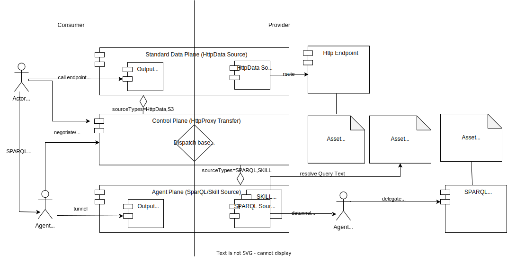

# Tractus-X Knowledge Agents EDC Extensions (KA-EDC)

The Tractus-X Knowledge Agents EDC Extensions (KA-EDC) repository creates runnable applications out of EDC extensions from
the [Eclipse DataSpace Connector](https://github.com/eclipse-edc/Connector) and [Tractus-X EDC](https://github.com/eclipse-tractusx/tractusx-edc) 
repositories.

## How it works



KA-EDC works as a kind of tunnel/dispatched for federated Semantic Web queries:
- An Agent (a REST endpoint controller) is headed towards a consuming parties intranet applications and speaks a standard query protocol (here: SPARQL in a federated profile called KA-MATCH).
- The Agent talks to the (standard) EDC Control Plane to negotiate/initiate an HttpProxy transfer to a target asset (Graph). It also overtakes the role of the application to manage any resulting Endpoint Data References (EDR).
- On the data provider side, any backend data sources (speaking a simpler, non-federated SPARQL profile called KA-BIND) will be registered using a dedicated asset type (cx-common:Protocol?w3c:http:SPARQL).
- When a graph asset is requested by the Agent, the Control Plane will produce an EDR to the KA-EDC Agent plane which has been registered to handle the corresponding asset types.
- Using the EDR's, the Agent will tunnel the SPARQL request (using the KA-TRANSFER profile) through the Agent Plane(s) where it will not directly hit its final destination.
- Instead, the consumer-side Agent engine will become active to validate, perform preprocessing and finally delegate the simpler KA-BIND calls to the actual endpoints. 
- The scheme is also used to store special query assets (called Skills using the asset type cx-common:Protocol?w3c:http:SKILL) which operate as a kind of stored procedures.

When running an EDC connector from the Tractus-X Knowledge Agents EDC Extensions repository there are three setups to choose from. They only vary by
using different extensions for

- Resolving of Connector-Identities
- Persistence of the Control-Plane-State
- Persistence of Secrets (Vault)

## Connector Setup

The three supported setups are.

- Setup 1: Pure in Memory & Hashicorp Vault **Not intended for production use!**
  - [Control Plane](https://github.com/eclipse-tractusx/edc-controlplane/edc-controlplane-memory-hashicorp-vault/README.md)
  - [Agent Plane](../agent-plane/agentplane-hashicorp/README.md)
      - [Data Plane](https://github.com/eclipse-tractusx/edc-dataplane/edc-dataplane-hashicorp-vault/README.md)
      - [JWT Auth Extension](../common/jwt-auth/README.md)
- Setup 2: PostgreSQL & Azure Vault 
    - [Control Plane](https://github.com/eclipse-tractusx/edc-controlplane/edc-controlplane-postgresql-azure-vault/README.md)
    - [Agent Plane](../agent-plane/agentplane-azure-vault/README.md)
        - [Data Plane](https://github.com/eclipse-tractusx/edc-dataplane/edc-dataplane-azure-vault/README.md)
        - [JWT Auth Extension](../common/jwt-auth/README.md)
- Setup 3: PostgreSQL & HashiCorp Vault
    - [Control Plane](https://github.com/eclipse-tractusx/edc-controlplane/README.md)
    - [Agent Plane](../agent-plane/agentplane-hashicorp/README.md)
        - [Data Plane](https://github.com/eclipse-tractusx/edc-dataplane/edc-dataplane-hashicorp-vault/README.md)
        - [JWT Auth Extension](../common/jwt-auth/README.md)

## Helm Deployment

To install a KA-enabled EDC (Setup 1 - Memory & Hashicorp Vault), add the following lines to the dependency section of your Charts.yaml

```yaml
dependencies:
  
    - name: agent-connector-memory
      repository: https://catenax-ng.github.io/product-knowledge/infrastructure
      version: 1.9.5-SNAPSHOT
      alias: my-connector
```

To install a KA-enabled EDC (Setup 2 -Postgresql & Azure Vault), add the following lines to the dependency section of your Charts.yaml

```yaml
dependencies:
  
    - name: agent-connector-azure-vault
      repository: https://catenax-ng.github.io/product-knowledge/infrastructure
      version: 1.9.5-SNAPSHOT
      alias: my-connector
```

To install a KA-enabled EDC (Setup 3 -Postgresql & Hashicorp Vault), add the following lines to the dependency section of your Charts.yaml

```yaml
dependencies:
  
    - name: agent-connector
      repository: https://catenax-ng.github.io/product-knowledge/infrastructure
      version: 1.9.5-SNAPSHOT
      alias: my-connector
```

The configuration in your values.yaml follows the [Tractux-X EDC Helm Chart](https://github.com/eclipse-tractusx/tractusx-edc/blob/main/charts/tractusx-connector/README.md), but provides for several data planes with different source type profiles including special settings for an Agent Plane.
The agent-connector chart is documented [here](charts/agent-connector/README.md).

```yaml
my-connector:
  participant:
    id: BPNL0000000DUMMY
  nameOverride: my-connector
  fullnameOverride: "my-connector"
  # -- Self-Sovereign Identity Settings
  ssi:
    miw:
      # -- MIW URL
      url: *miwUrl
      # -- The BPN of the issuer authority
      authorityId: *issuerAuthority
    oauth:
      # -- The URL (of KeyCloak), where access tokens can be obtained
      tokenurl: *keyCloakRealm
      client:
        # -- The client ID for KeyCloak
        id: *keyCloakClient
        # -- The alias under which the client secret is stored in the vault.
        secretAlias: "client-secret":
  # -- The Vault Settings can be Azure or Hashicorp
  vault: *vaultSettings
  # -- The Control plane
  controlplane:
    ## Ingress declaration to expose the control plane
    ingresses:
      - enabled: true
        # -- The hostname to be used to precisely map incoming traffic onto the underlying network service
        hostname: "myconnector.public.ip"
        # -- EDC endpoints exposed by this ingress resource
        endpoints:
          - protocol
          - management
          - control
        # -- Enables TLS on the ingress resource
        tls:
          enabled: true
        # -- If you do not have a default cluster issuer
        certManager:
          issuer: my-cluster-issuer
  # -- The Data planes
  dataplanes:
    # -- Default data plane is already an agent plane (has the agent section non-empty)
    dataplane:
      # -- Additional or default resources 
      configs: 
        # -- Overides the default dataspace.ttl to include all important BPNs and connectors
        dataspace.ttl: |-
          ################################################
          # Agent Bootstrap Graph
          ################################################
          @prefix cx-common: <https://w3id.org/catenax/ontology/common#> .
          @prefix bpnl: <bpn:legal:> .
          @prefix : <GraphAsset?local=Dataspace> .
          @base <GraphAsset?local=Dataspace> .

          bpnl:BPNL0000000DUMMY cx-common:hasConnector <edcs://myconnector.public.ip>.
          bpnl:BPNL0000000DUMM2 cx-common:hasConnector <edcs://otherconnector.public.ip>.
      # -- Agent configuration (if non-zero its an agent plane)
      agent:
        # -- Maximal number of tuples processed in one sub-query
        maxbatchsize: 8
        # -- Number of seconds between synchronization runs
        synchronization: 60000
        # -- URLs of the remote connectors to synchronize the catalogue with
        connectors: 
          - https://otherconnector.public.ip
      ## Ingress declaration to expose data plane
      ingresses:
        - enabled: true
          hostname: "myagent.public.ip"
          # -- EDC endpoints exposed by this ingress resource
          endpoints:
            - public
            - default
            - control
            - callback
          # -- Enables TLS on the ingress resource
          tls:
            enabled: true
          # -- If you do not have a default cluster issuer
          certManager:
            issuer: my-cluster-issuer
```

## Recommended Documentation

### This Repository

- [Application: Agent Plane](../agent-plane)
- [Extension: JWT Authentication](../common/auth-jwt/README.md)

### Tractus-X EDC

- [Tractus-X EDC Documentation](https://github.com/eclipse-tractusx/docs/Readme.md)

### Eclipse Dataspace Connector

- [EDC Domain Model](https://github.com/eclipse-edc/Connector/blob/main/docs/developer/architecture/domain-model.md)
- [EDC Open API Spec](https://github.com/eclipse-edc/Connector/blob/main/resources/openapi/openapi.yaml)
- [HTTP Receiver Extension](https://github.com/eclipse-edc/Connector/tree/main/extensions/control-plane/http-receiver)
